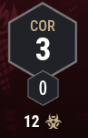
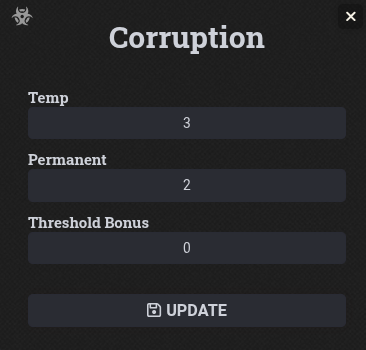
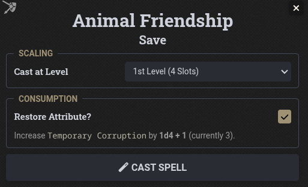
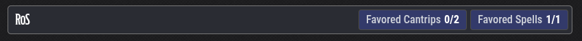
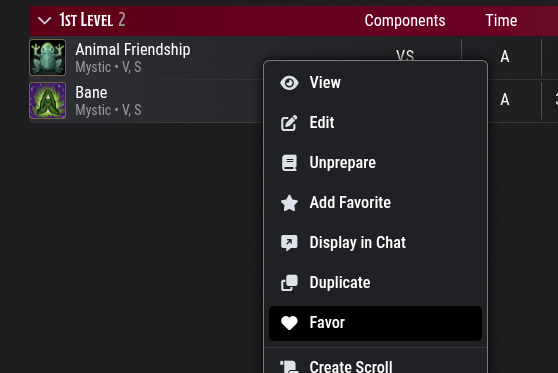
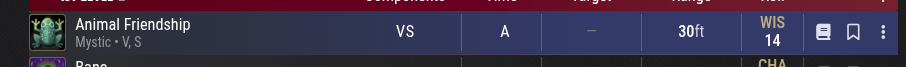

# Ruins of Symbaroum Foundry VTT Module

This module implements the core mechanics of the **Ruins of Symbaroum** conversion for Foundry VTT (DnD5e system). It adds support for corruption, revised resting rules, and integrated data.

Head over to [Free League Publishing](https://freeleaguepublishing.com) to get the core rulebooks.
This module is useless without the sourcebooks, support the creators!

## Prerequisites

To use this module, you must have the following installed and active:

- **System**: [dnd5e](https://foundryvtt.com/packages/dnd5e) (Minimum version 5.2.4)
- **Required Modules**:
  - [lib-wrapper](https://foundryvtt.com/packages/lib-wrapper)
  - [tidy5e-sheet](https://foundryvtt.com/packages/tidy5e-sheet) (The module only supports use of the new tidy-5e-sheet variant)
  - plutonium (Required for importing Symbaroum brew data)

**NOTE**: Please do not contact the developers of the above modules for support with this module, feel free to raise an issue on this github repository.

## Installation

1. Open the Foundry VTT Setup screen.
2. Go to the **Add-on Modules** tab.
3. Click **Install Module**.
4. Paste the following Manifest URL: `https://raw.githubusercontent.com/awarenet/ros5e/latest/module.json`
5. Click **Install**.
6. Once enabled, the module will automatically set the local homebrew directory to the module's brew folder.

## Usage

### 1. Importing Data

Custom data for Ruins of Symbaroum (Races, Subclasses, Spells, etc.) is included in this module. Use Plutonium to import this data into your game.
The sources in Plutonium are prefixed with Awarenet; Ruins of Symbaroum.

Once you import an RoS race or class, the actor will get a flag that will cause the actor sheet to display the correct data.

**NOTE**: RoS approaches have been implemented as subclasses.

### 2. Corruption

The module implements the Symbaroum corruption system:

There is a new pip on the ability bar called Corruption (COR).

- The top (large) number is the total (permanent + temporary) corruption.
- The middle (small) number is the permanent corruption.
- The bottom (small) number is the actor's corruption threshold.

Clicking the corruption resource will open the corruption dialog, which allows you to manually adjust the corruption values.

Corruption is automatically tracked on the character. When casting spells or using certain abilities, the module will prompt or automatically calculate the corruption gain based on your class features (e.g., Troll Singers have specific checks).

More on specific mechanics below.

#### Marks of Corruption

A roll table is included in the module for rolling on the marks of corruption table. Use Plutonium to import it.

Feats are also included in the module for adding marks of corruption to characters. Use Plutonium to import them.

### 3. Resting

RoS resting is a part of the module. The extended rest button has been added to the character sheet.

The various RoS rest options are available in each rest dialog.

### 4. Currency

The Symbaroum currency system is implemented, however you can override the currency system by disabling the "Use Symbaroum Currency" flag in the settings.

The currency is a straight relabel of the dnd5e currency system, if this setting is enabled then it is converted to the Symbaroum currency system.

- pp: hidden
- ep: hidden
- gp: "Thaler"
- sp: "Shilling"
- cp: "Orteg"

### 5. Spellcasting

Spells need to be imported from the RoS data sets included in this module, in order for the module to know how to handle their corruption costs.

Corruption is calculated based on the spell's corruption cost, including favored spell adjustments, and the caster's approach features.

Innate spells are imported for any spells not learned, i.e additional spells.

Known spells are imported for any spells learned.

Therefore you should import spells as you level from the module's data sets.

When you roll a spell, the dialog will show the corruption cost (including any modifiers) and the amount of temporary corruption you currently have.

**Unchecking** the Restore Attribute checkbox will prevent the temporary corruption from being added to the character when the spell is cast.

The bottom RoS caster bar has been added for any spellcaster character. It is used to track the caster's known spells, favored spells and other spellcasting related features.

#### Favored Spells

You can favor/unfavor spells by right clicking on the spell in the spellbook.

When a spell is favored, it will get a blue background.

#### Talismans

TBD

#### Troll Singers

TBD

## Got Issues or Ideas?

Feel free to open an issue on this github repository.
